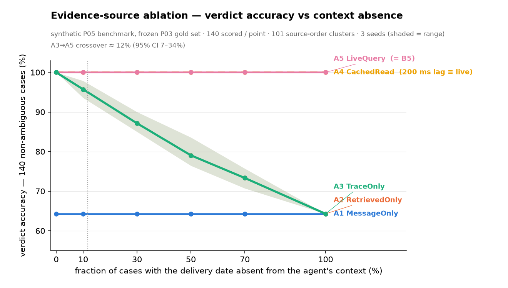
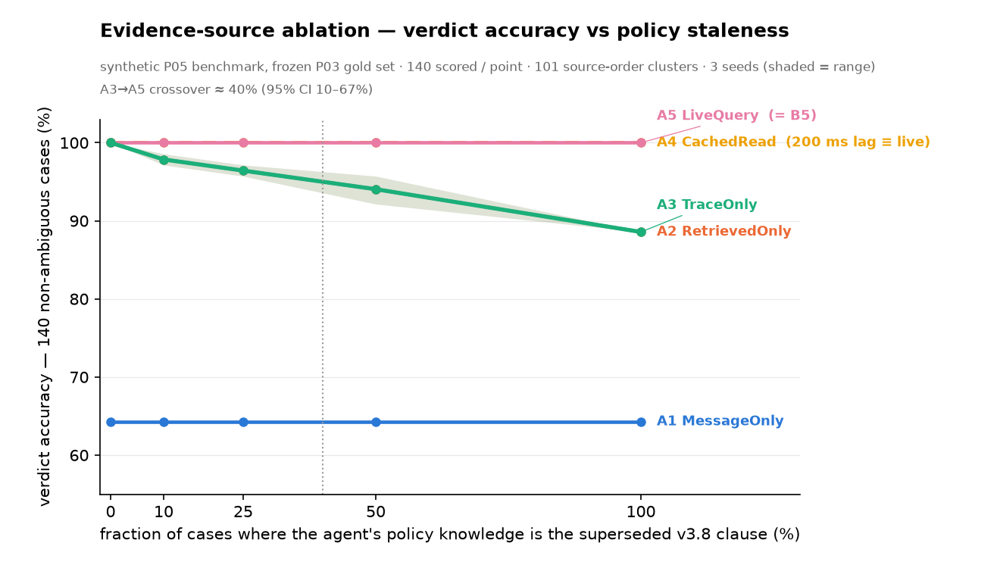

# P05 — the evidence-source ablation

**The one variable.** Every published neighbour either intercepts the tool call (AEGIS) or grounds a claim in one of the agent's own tool results (AgentLTL). Neither fetches the load-bearing fact by an *independent* query at decision time. Holding the pipeline, policy, tools and history fixed (LedgerAgent's ablation design), this experiment varies only the **evidence source** — and each arm reads exactly one channel.

| arm | evidence channel | models |
|---|---|---|
| **A1 MessageOnly** | `customer_message` | post-hoc extraction of the user turn |
| **A2 RetrievedOnly** | `retrieval_chunks` | RAG grounding — witness is the retrieved chunk |
| **A3 TraceOnly** | `agent_trace` | AgentLTL kappa-3 — witness is a prior tool output |
| **A4 CachedRead** | `store_replica` | CDC / event-sourced read, 200 ms behind the primary |
| **A5 LiveQuery** | `live_store` | independent query at decision time (ControlPlane) |

All five call `_run_pipeline(case, <ArmStrategy>())`, which delegates **unchanged** to P04's `bench.baselines._run_our_pipeline`. `STRATEGY_BY_ARM` maps each arm id to a bare strategy class — the injected strategy is the only difference. **A5 is P04's B5 verbatim.** `tests/test_evidence_ablation.py` asserts this by AST and by a `sqlite3.connect` spy.

Gold set: FROZEN `bench/gold_set.jsonl` (P03), SHA-256 `09deaecb374eb6b6…`; labels from `bench/label.py`, never `decide()`. Metrics on the 140 non-ambiguous cases; positive = gold BLOCK ∪ ESCALATE; a system *flags* on BLOCK / ESCALATE / MODIFY.

## Prediction (recorded before the results were computed)

> We predict that at 0% absence and 0% staleness, A3 and A5 are statistically indistinguishable, because when the fact is present and current in the agent's context, inheriting it and fetching it return the same value. We predict the gap opens approximately linearly in both variables. The crossover point — the level of context degradation at which independent re-query begins to pay — is the finding. If A3 matches A5 everywhere, that is a real and publishable negative result for our own thesis and we report it as such.

_This is the pre-registered prediction from the first P05 run; it is kept verbatim. The arms A3 and A4 were re-implemented after a methodology audit (see § differences); the prediction was not rewritten._

## Arm provenance — exact source consumed

| arm | reads |
|---|---|
| A1 MessageOnly | `case['_message']` — the synthetic customer-message fixture (date/total stripped when absence-perturbed) + `session.customer_id` + structural tool-call args. No policy text. |
| A2 RetrievedOnly | `case['_retrieval']` ONLY — retrieved chunks: the v4.2 or v3.8 clause, the authority clause, and a retrieved order-record snapshot (date, total, attributes, customer all parsed from that chunk). No message, no trace, no store. |
| A3 TraceOnly | `case['_trace']` ONLY — the agent's prior `get_order` / `get_policy` tool results. No message, no retrieval, no `claimed_*`, no store. |
| A4 CachedRead | `_replica/orders.db` (byte copy) + `_replica/policy_store_asof_200ms.db` (a genuine point-in-time snapshot taken 200 ms before decision time). Never the live stores, never the context. On this frozen data the 200 ms-stale read returns the same clause (v4.2/7d) as live. |
| A5 LiveQuery | `data/orders.db` + `data/policy_store.db` live, via `baselines.LiveQueryStrategy` (`resolve_bindings` + a `SELECT` on the current clause). Structural action fields only. |

**Structural-isolation probe** (each arm run once under a `sqlite3.connect` spy, before the grid):

| arm | database files opened |
|---|---|
| A1 MessageOnly | `— none —` |
| A2 RetrievedOnly | `— none —` |
| A3 TraceOnly | `— none —` |
| A4 CachedRead | `orders.db`, `policy_store_asof_200ms.db` |
| A5 LiveQuery | `orders.db`, `policy_store.db` |

**A4 — what "200 ms stale" means here.** A4 is a genuine independent query of a genuine point-in-time replica:

| property | value |
|---|---|
| modelled replication lag | 200 ms |
| actual snapshot instant | 2026-08-14T09:59:59.800000+00:00 (clock.now() - 200 ms) |
| snapshot as-of date | 2026-08-14 |
| last store mutation | 2026-08-01 (13 days before the snapshot) |
| replica serves refund_window | v4.2/7d |
| live serves refund_window | v4.2/7d |
| **stale value differs from current?** | **NO** |

200 ms lag is far inside the 13-day gap to the last store change, and the clause store is day-granular, so A4's snapshot serves the same clause (v4.2/7d) as the live store. A4 == A5 in returned values here — measured, because A4 executes an independent query against a separate replica file.

It is **not** literally the case that a 200 ms lag changes any answer on this dataset — there is no sub-day write dynamics to catch. The 200 ms is a real modelled CDC latency (reported in the latency column, not a `sleep`, not a substitute for staleness). What a *larger* lag costs is in § Replication-lag sensitivity. See `bench/fixtures/p05/README.md` for the context-fixture provenance.

## Controls

- **Seeds** `[0, 1, 2]` — the seed selects which cases are perturbed at a given fraction (nested subsets). Reported as mean [min, max].
- **Grid** — full cross: 5 arms x 6 absence x 5 staleness x 3 seeds = 450 cells; the two line charts are the staleness=0 and absence=0 slices.
- **Absence** — removed from the message, the retrieval snapshot, AND the trace (no get_order step).
- **Staleness** — the agent's policy knowledge is the superseded v3.8 30-day clause (retrieved text / trace get_policy result). A4 is not part of this sweep — it is an independent read; see § A4 above and § Replication-lag sensitivity.
- **Structural control** — all five arms call _run_pipeline(case, <ArmStrategy>()), which delegates unchanged to bench.baselines._run_our_pipeline. STRATEGY_BY_ARM maps each arm id to a bare strategy class; the injected strategy is the only difference.
- **Crossover margin** — 5 points of verdict accuracy.
- **Context fixture** SHA-256 `c9cd423e20b76aa0…` (synthetic, committed, pinned).

## Results — context absence sweep (other variable pinned at 0%)

| arm | 0% | 10% | 30% | 50% | 70% | 100% |
|---|--:|--:|--:|--:|--:|--:|
| A1 MessageOnly | 64.3% [64.3, 64.3] | 64.3% [64.3, 64.3] | 64.3% [64.3, 64.3] | 64.3% [64.3, 64.3] | 64.3% [64.3, 64.3] | 64.3% [64.3, 64.3] |
| A2 RetrievedOnly | 100.0% [100.0, 100.0] | 95.7% [93.6, 97.9] | 87.1% [85.0, 90.0] | 79.0% [76.4, 83.6] | 73.3% [70.7, 75.7] | 64.3% [64.3, 64.3] |
| A3 TraceOnly | 100.0% [100.0, 100.0] | 95.7% [93.6, 97.9] | 87.1% [85.0, 90.0] | 79.0% [76.4, 83.6] | 73.3% [70.7, 75.7] | 64.3% [64.3, 64.3] |
| A4 CachedRead | 100.0% [100.0, 100.0] | 100.0% [100.0, 100.0] | 100.0% [100.0, 100.0] | 100.0% [100.0, 100.0] | 100.0% [100.0, 100.0] | 100.0% [100.0, 100.0] |
| A5 LiveQuery | 100.0% [100.0, 100.0] | 100.0% [100.0, 100.0] | 100.0% [100.0, 100.0] | 100.0% [100.0, 100.0] | 100.0% [100.0, 100.0] | 100.0% [100.0, 100.0] |

_verdict accuracy, mean [min, max] % across 3 seeds_

per-seed accuracy — context absence

| arm | 0% | 10% | 30% | 50% | 70% | 100% |
|---|--:|--:|--:|--:|--:|--:|
| MessageOnly | 64.3/64.3/64.3 | 64.3/64.3/64.3 | 64.3/64.3/64.3 | 64.3/64.3/64.3 | 64.3/64.3/64.3 | 64.3/64.3/64.3 |
| RetrievedOnly | 100.0/100.0/100.0 | 95.7/97.9/93.6 | 85.0/90.0/86.4 | 77.1/83.6/76.4 | 73.6/75.7/70.7 | 64.3/64.3/64.3 |
| TraceOnly | 100.0/100.0/100.0 | 95.7/97.9/93.6 | 85.0/90.0/86.4 | 77.1/83.6/76.4 | 73.6/75.7/70.7 | 64.3/64.3/64.3 |
| CachedRead | 100.0/100.0/100.0 | 100.0/100.0/100.0 | 100.0/100.0/100.0 | 100.0/100.0/100.0 | 100.0/100.0/100.0 | 100.0/100.0/100.0 |
| LiveQuery | 100.0/100.0/100.0 | 100.0/100.0/100.0 | 100.0/100.0/100.0 | 100.0/100.0/100.0 | 100.0/100.0/100.0 | 100.0/100.0/100.0 |

## Results — policy staleness sweep (other variable pinned at 0%)

| arm | 0% | 10% | 25% | 50% | 100% |
|---|--:|--:|--:|--:|--:|
| A1 MessageOnly | 64.3% [64.3, 64.3] | 64.3% [64.3, 64.3] | 64.3% [64.3, 64.3] | 64.3% [64.3, 64.3] | 64.3% [64.3, 64.3] |
| A2 RetrievedOnly | 100.0% [100.0, 100.0] | 97.9% [97.1, 98.6] | 96.4% [95.7, 97.1] | 94.0% [92.1, 95.7] | 88.6% [88.6, 88.6] |
| A3 TraceOnly | 100.0% [100.0, 100.0] | 97.9% [97.1, 98.6] | 96.4% [95.7, 97.1] | 94.0% [92.1, 95.7] | 88.6% [88.6, 88.6] |
| A4 CachedRead | 100.0% [100.0, 100.0] | 100.0% [100.0, 100.0] | 100.0% [100.0, 100.0] | 100.0% [100.0, 100.0] | 100.0% [100.0, 100.0] |
| A5 LiveQuery | 100.0% [100.0, 100.0] | 100.0% [100.0, 100.0] | 100.0% [100.0, 100.0] | 100.0% [100.0, 100.0] | 100.0% [100.0, 100.0] |

_verdict accuracy, mean [min, max] % across 3 seeds_

per-seed accuracy — policy staleness

| arm | 0% | 10% | 25% | 50% | 100% |
|---|--:|--:|--:|--:|--:|
| MessageOnly | 64.3/64.3/64.3 | 64.3/64.3/64.3 | 64.3/64.3/64.3 | 64.3/64.3/64.3 | 64.3/64.3/64.3 |
| RetrievedOnly | 100.0/100.0/100.0 | 97.9/97.1/98.6 | 97.1/96.4/95.7 | 92.1/95.7/94.3 | 88.6/88.6/88.6 |
| TraceOnly | 100.0/100.0/100.0 | 97.9/97.1/98.6 | 97.1/96.4/95.7 | 92.1/95.7/94.3 | 88.6/88.6/88.6 |
| CachedRead | 100.0/100.0/100.0 | 100.0/100.0/100.0 | 100.0/100.0/100.0 | 100.0/100.0/100.0 | 100.0/100.0/100.0 |
| LiveQuery | 100.0/100.0/100.0 | 100.0/100.0/100.0 | 100.0/100.0/100.0 | 100.0/100.0/100.0 | 100.0/100.0/100.0 |

## Full interaction grid — A3 TraceOnly, mean verdict accuracy

Rows = absence, columns = staleness. Both independent arms are flat across the whole grid: A5 LiveQuery and A4 CachedRead (200 ms lag) both at 100.0%.

| absence \ staleness | 0% | 10% | 25% | 50% | 100% |
|---|--:|--:|--:|--:|--:|
| **0%** | 100.0% | 97.9% | 96.4% | 94.0% | 88.6% |
| **10%** | 95.7% | 93.8% | 92.6% | 90.2% | 85.2% |
| **30%** | 87.1% | 85.2% | 84.5% | 82.9% | 78.8% |
| **50%** | 79.0% | 77.6% | 77.1% | 76.2% | 74.1% |
| **70%** | 73.3% | 72.4% | 71.9% | 71.7% | 71.0% |
| **100%** | 64.3% | 64.3% | 64.3% | 64.3% | 64.3% |

## Crossover — A3 (inherit) vs A5 (fetch)

### absence sweep

- diff curve (A5−A3 accuracy per grid point): `[0.0, 0.0429, 0.1286, 0.2095, 0.2667, 0.3571]`
- **crossover ≈ 11.7% absence** (piecewise-linear interpolation to a 5-pt gap)
- 95% CI (cluster bootstrap, 2000 resamples of the source-order clusters): **[6.6%, 34.4%]**; median 11.8%
- crossing never reached the 5-pt margin within the swept range in 8/2000 bootstrap resamples

### staleness sweep

- diff curve (A5−A3 accuracy per grid point): `[0.0, 0.0214, 0.0357, 0.0595, 0.1143]`
- **crossover ≈ 40.0% staleness** (piecewise-linear interpolation to a 5-pt gap)
- 95% CI (cluster bootstrap, 2000 resamples of the source-order clusters): **[9.9%, 67.0%]**; median 35.6%
- crossing never reached the 5-pt margin within the swept range in 8/2000 bootstrap resamples

## Replication-lag sensitivity (A4 alone, not one of the five arms)

A4 is *defined* at a 200 ms lag, which on this frozen dataset returns the same values as live. The honest follow-up: at what replication lag does an independent cached read *start* to cost accuracy? For each lag L, A4's strategy is pointed at the policy snapshot as-of (demo clock − L) and scored on the same 140 cases (absence=0 / staleness=0).

| replication lag | snapshot as-of | replica refund_window | verdict accuracy |
|---|---|---|--:|
| 200 ms | 2026-08-14 | v4.2/7d | 100.0% |
| 1 d | 2026-08-13 | v4.2/7d | 100.0% |
| 7 d | 2026-08-07 | v4.2/7d | 100.0% |
| 13 d | 2026-08-01 | v4.2/7d | 100.0% |
| 14 d | 2026-07-31 | v3.8/30d **(pre-cutover)** | 88.6% |
| 30 d | 2026-07-15 | v3.8/30d **(pre-cutover)** | 88.6% |
| 90 d | 2026-05-16 | v3.8/30d **(pre-cutover)** | 88.6% |

A4's cached read costs 0 accuracy for any replication lag below 13 days (the snapshot still serves v4.2/7d). Once the lag exceeds 13 days the snapshot predates the 2026-08-01 cutover and serves v3.8/30d, costing 11.4 points. The specified 200 ms model sits on the flat (zero-cost) part of this step function.

So the **freshness cost is a step function of the lag**: 0 points for lag < 13 days, 11.4 points for lag ≥ 13 days. The specified 200 ms model is on the zero-cost part.

## Did the prediction hold?

**Parity at the origin: held.** At absence=0 / staleness=0 the mean A5−A3 gap is +0.0 pts (absence sweep) / +0.0 pts (staleness sweep). A3, reading only the agent's accurate prior tool outputs, matches the independent live query when the trace is complete and current — as predicted.

**The gap opens with degradation.** Absence diff curve `[0.0, 0.043, 0.129, 0.209, 0.267, 0.357]` (monotone); staleness diff curve `[0.0, 0.021, 0.036, 0.059, 0.114]` (monotone). Both open roughly linearly, as predicted.

**Absence crossover ≈ 12%** (95% CI [7%, 34%]). Below this level of absence degradation the two are interchangeable; above it, only the independent fetch holds accuracy.

**Staleness crossover ≈ 40%** (95% CI [10%, 67%]). Below this level of staleness degradation the two are interchangeable; above it, only the independent fetch holds accuracy.

## Interpretation

This tells a deployer when the independent query is worth its latency. Where the load-bearing fact is reliably present and current in the agent's trace, trace-grounded verification (A3) equals the live query (A5) and the extra fetch is wasted work. As the trace degrades — a missing `get_order`, a stale `get_policy` — every point of degradation is verdict accuracy that only an independent fetch recovers. The crossover is where that line sits.

**Independence vs freshness — this benchmark isolates independence, not freshness.** Both independent arms (A5 live, A4 at the CDC model's 200 ms lag) hold flat at 100.0% across the whole grid, while all three inherited-context arms fall as the context degrades. That is the thesis result: what matters is that the read is independent of the agent's context. Whether *freshness* also matters cannot be read off the main grid — the stores are frozen and the last policy change is 13 days old, so a 200 ms lag catches nothing. The **replication-lag sensitivity** answers it separately: an independent read costs 0 points until its lag exceeds 13 days (the age of the last policy change), then steps down 11.4 points. So a realistic CDC replica (sub-second lag) is as good as a live query here; only a badly lagged one is not.

**A1 / A2.** MessageOnly cannot verify anything policy-dependent (a customer states facts about their order, not the returns clause), so it escalates almost everything and sits at the 90/140 = 64.3% floor. RetrievedOnly starts level with A5 and falls under both perturbations, tracking A3 closely — RAG-grounding and trace-grounding are both “inherit from context” and fail the same way; what separates the field is inheritance vs an independent query.

## Differences from the first (invalid) P05 implementation

The first run was audited and found not to satisfy the literal arm definitions. Corrections, all confined to P05 files:

1. **A3** was full-context grounding (message + retrieved + `claimed_*`). It is now `TraceOnly`: it reads **only** the agent's serialized prior tool outputs (`get_order` / `get_policy` results). Absence now means *the agent never called `get_order`* (the step is missing), not *the date was deleted from prose*. A3 also now catches wrong-order distractors (the trace's `get_order` returns the resolved order's real attributes).
2. **A4** was `A5` + a latency constant — it could never diverge, and the second pass over-corrected it to a *weeks*-old snapshot and (wrongly) called that “200 ms stale”. It is now a **genuine point-in-time replica taken exactly 200 ms before decision time**. On this frozen data that read returns the same clause as live (last write is 13 days old; the clause store is day-granular), so **A4 = A5 in accuracy — measured**. The cost of a *larger* lag is quantified separately in § Replication-lag sensitivity (a step function: 0 pts below ~13 days, 11.4 pts above).
3. **A1** now reads a **clearly labelled synthetic customer-message fixture** (`bench/fixtures/p05/`), not a rewritten `justification`.
4. The first run's **"independence, not freshness" claim** and the second pass's **"freshness costs 11.4 pts" headline** are both **withdrawn**. The honest statement: at the CDC model's 200 ms lag this benchmark does not separate independence from freshness for A4 (there is no write within any 200 ms window to catch). What it shows: all three inherited-context arms degrade under context loss while both independent arms hold — and the sensitivity analysis shows freshness only bites once the lag exceeds the age of the last policy change.

## Limitations

- **Synthetic, single-domain benchmark.** 150 refund cases, 101 source-order clusters; the 50 ALLOW cases sit on 5 real orders. All CIs resample clusters.
- **The three context channels are synthetic P05 fixtures.** Their construction is identical for every arm and is documented in `bench/fixtures/p05/README.md`. The delivery date and order total in the message/snapshot/trace are the true record values (a real customer / a real earlier fetch would have them); the absence sweep is what removes them. The gold label, tool-call args, stores, `decide.py`, predicate graph and manifest are untouched.
- **A4's 200 ms lag is not exercised by this dataset.** The stores are frozen; the most recent write (the policy cutover) is 13 days before the demo clock; the clause store has day-granular effective dates. So a 200 ms-stale read is byte-for-byte a current read — A4 = A5 here, and this benchmark cannot separate *independence* from *freshness* for A4. § Replication-lag sensitivity fills that gap by stressing A4's lag directly; it is a separate one-variable analysis, not one of the five arms.
- **No agent version-assertion.** The P05 agent applies a window but emits no policy-version string, so `decide()`'s clause-currency check is inert here and staleness shows up purely as the wrong window length. This is deliberate: injecting a v3.8 *assertion* would, by P03's own rules, flip the case's correct label to BLOCK, which we must not do.
- **The crossover margin (5 pts) is a choice.** `reports/summary.json[p05_evidence_ablation].crossover.point_diff_curve` lets a reader re-solve for any margin.

